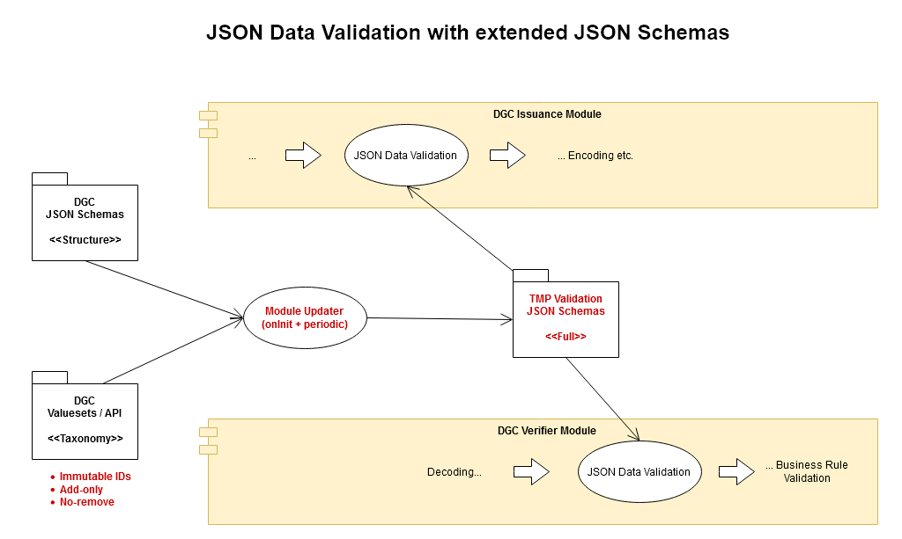

# Proof of Concept: DGC JSON Data Validation with extended JSON Schemas 


## Idea

Instead of using different mechanisms for validating the structure and taxonomy ("ValueSets") references of DGC JSON Data, a *standardized* JSON Schema validation mechanism is leveraged for an integral data pre-check. 

During the DGC Issuance workflow passing this data pre-check could be a mandatory assertion for further processing (encoding, signing, etc.).

During the DGC Verification workflow a successful data pre-check could be required for the further application of the business rule logic.

This procedure would especially make sense if the taxonomy value (sub-)sets would be specified at EU level, in contrast to national business rules.

## Preconditions

Key requirements for a successful implementation of this proposal:

(1) "Add-only" taxonomy value sets (no removal of elements)

(2) Immutable value IDs (no ID changes)

## Overview



## Usage

### /data

#### /dgc-testdata-latest

The test data comes from the [DGC Test Data Repository](https://github.com/eu-digital-green-certificates/dgc-testdata)

Feel free to update the test data regularly.

#### /examples-latest

The test data comes from the [Digital Green Certificate Schema](https://github.com/ehn-digital-green-development/ehn-dgc-schema) project.

Feel free to use your own examples.

***

### /resources-tmp

Here are the temporary JSON schema files stored.

The generated file

*DGC.Schema.Combined.Full.json*

is the combined and value-extended full JSON schema used for all further validations.

***

### /spec

#### /structure/jsonschema

This folder contains the different official release versions of the 
 [Digital Green Certificate Schema](https://github.com/ehn-digital-green-development/ehn-dgc-schema).

#### /structure/taxonomy

This folder contains the DGC taxonomy in form of "ValueSets" from the
[Digital Green Certificate Schema](https://github.com/ehn-digital-green-development/ehn-dgc-schema) repository.


***

### /src

This place is for different prototype implementations.

#### /js

Here you can find a JS (ES6) prototype implementation for the **updater** and the **validator**.

For convenience there's also a small **cleaner** utility that allows removing all non-JSON files from newly imported test data.

Feel free to try them out <ins>at your own risk</ins>:

1.) Install NPM and dependencies from the *main package folder*

```
$ npm i
```


2.) Run the updater from the *main package folder*

```
$ npm run updater
```

*Always run it again after updating /spec data.*


3.) Run the validator from the *main package folder*

```
$ npm run validator
```
*Run it again after updating /data files.*

4.) Check the validation log files under /test


### /log

#### /dgc-testdata-latest

Here you can find the validation test log files for the files validated from /data/dgc-testdata-latest

#### /examples-latest

Here you can find the validation test log files for the files validated from /data/exmamples-latest

####

## ToDo

- [ ] Add error handling
  - [ ] Invalid schema ver
  - [ ] ...

## Questions

Please feel free to create an issue.


## License

For the source code under /src and this documentation:

&copy; 2021 miguelzapaton and all other contributors

Licensed under the **Apache License, Version 2.0** (the "License"); you may not use this file except in compliance with the License.

You may obtain a copy of the License at https://www.apache.org/licenses/LICENSE-2.0.

Unless required by applicable law or agreed to in writing, software distributed under the License is distributed on an "AS IS" BASIS, WITHOUT WARRANTIES OR CONDITIONS OF ANY KIND, either express or implied. See the [LICENSE](./LICENSE) for the specific language governing permissions and limitations under the License.
